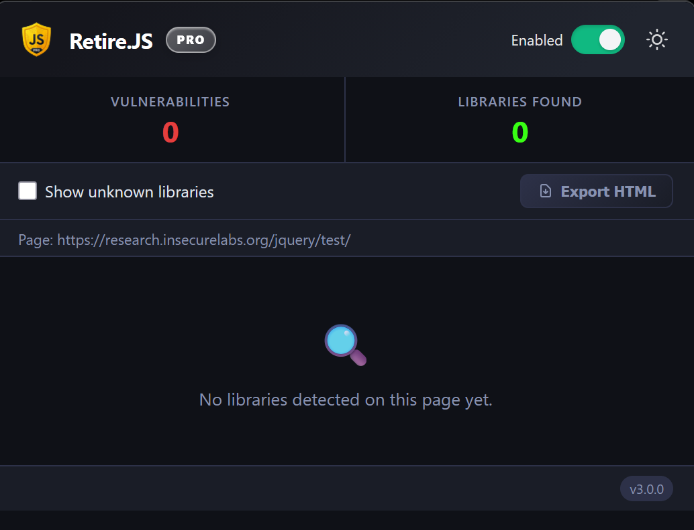
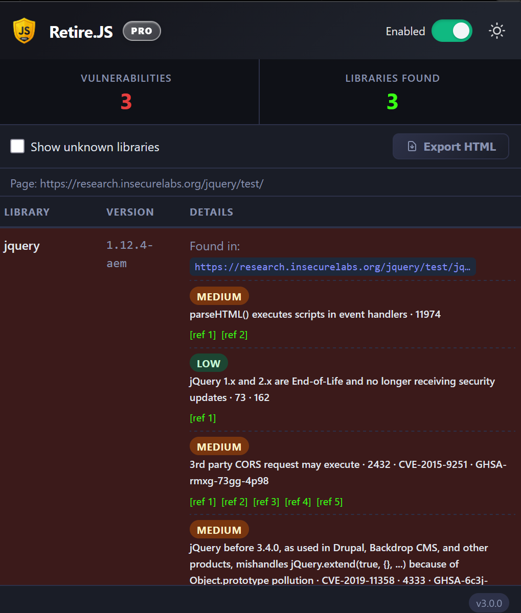
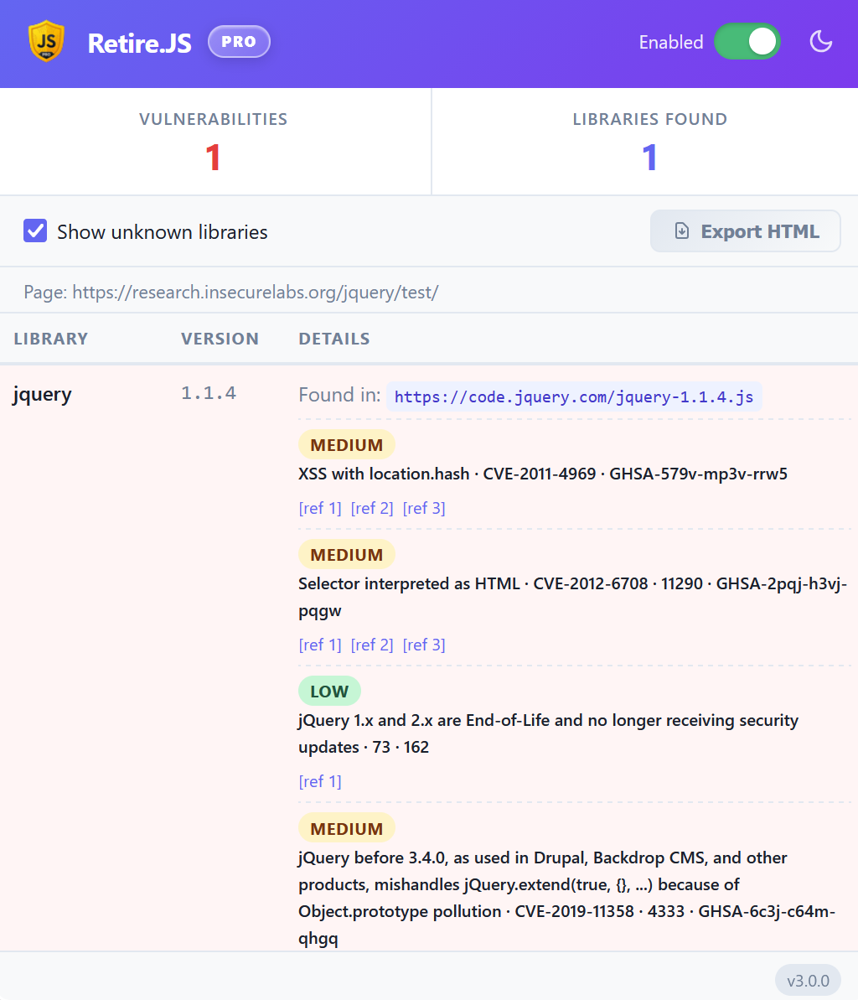

<p align="center">
  
</p>

# Retire.JS Pro

<p align="center">
  
  
  
  
  
  
  
</p>


> A Firefox browser extension (Chromium under development) that detects vulnerable JavaScript libraries on every page you visit — in real time, entirely locally, with zero data collection.

Built on top of the [RetireJS](https://github.com/RetireJS/retire.js) detection engine and vulnerability database.

---

## Features

- 🚀 **Real-time scanning** — Automatically scans page scripts via `webRequest` as they load.
- 🔍 **Multi-method Detection** — URI, filename, file content, SHA1 hash, and runtime global probing.
- 🛡️ **Comprehensive Advisories** — Full details including severity, CVE/GHSA IDs, and external links.
- 🌙 **Persistent Dark Mode** — Premium dark UI by default with a sleek high-contrast toggle.
- 📊 **Theme-Aware Reports** — Export self-contained HTML reports that match your active theme.
- 🔗 **Contextual Info** — Scanned URLs are preserved in the header and all exported exports.
- ⚡ **Dynamic Versioning** — Runtime manifest sync ensures you always see the correct version.
- 🔒 **Privacy First** — 100% local processing; zero telemetry, zero trackers, zero data collection.

---

## Screenshots

<table>
  <tr>
    <td align="center">
      
      <br><sub>Dark (no results)</sub>
    </td>
    <td align="center">
      
      <br><sub>Dark (with results)</sub>
    </td>
    <td align="center">
      
      <br><sub>Light (with results)</sub>
    </td>
  </tr>
</table>

More screenshots (including report export) are in [docs/SCREENSHOTS.md](docs/SCREENSHOTS.md).


## Installation

| Platform | Status | Links |
| :--- | :--- | :--- |
| **Firefox** |  | <a href="https://addons.mozilla.org/en-US/firefox/addon/retire-js-pro/" target="_blank" rel="noopener">&nbsp;&nbsp;Firefox</a> |
| **Chromium** |  | *Coming soon to Chrome Web Store* |

### Manual Installation (Testing Only)

1. Download the latest `.xpi` from **[Releases](https://github.com/silico-industries/retire.js-pro/releases)**.
2. Open Firefox and navigate to `about:debugging#/runtime/this-firefox`.
3. Click **Load Temporary Add-on…** and select the downloaded file.
4. Visit any website and grant permissions when prompted.
5. Click the **Retire.JS Pro** icon in your toolbar.
<br>

> Unsigned extensions loaded via `about:debugging` are removed when Firefox restarts. For a persistent install, please use the official AMO release.

---

## How It Works

For every script request the browser makes, the extension runs five detection passes in sequence. This multi-layered approach ensures detection even if a library is minified, renamed, or bundled.

1.  **URI scan** — Matches the script URL against known patterns.
2.  **Filename scan** — Checks the filename against known library naming conventions.
3.  **Content scan** — Analyzes the script body for embedded version markers.
4.  **Hash scan** — Computes the SHA1 hash and compares it against the database.
5.  **Function scan** — Evaluates the script in a [sandboxed environment](docs/ARCHITECTURE.md#sandbox-architecture) to probe runtime globals.

Matches are cross-referenced with the bundled vulnerability database to resolve severity levels and advisory links.

> 📖 **Architecture Deep Dive:** For a technical overview of the detection pipeline and sandbox implementation, see the **[Architecture Documentation](docs/ARCHITECTURE.md)**.

---

## Vulnerability Database

The bundled database (`firefox/source/js/jsrepository.json`) is sourced directly from [RetireJS upstream](https://github.com/RetireJS/retire.js/blob/master/repository/jsrepository.json).

Current bundle covers **65 libraries** and **488 vulnerability records**, including 346 CVEs (in 3.0.0 release).

To update it manually, replace the file with the latest upstream version and reload the extension.

---

## Repository Structure

```
retire.js-pro/
├── firefox/                   — Firefox MV3 extension
│   └── source/
│       ├── manifest.json
│       ├── popup.html
│       ├── background.html
│       ├── sandbox.html
│       ├── inner-sandbox.html
│       ├── icons/
│       └── js/
│           ├── popup.js
│           ├── background.js
│           ├── content.js
│           ├── sandbox.js
│           ├── innersandbox.js
│           ├── retire.js           — RetireJS detection engine (upstream)
│           ├── jsrepository.json   — Vulnerability database (upstream)
│           ├── sha1.js             — SHA1 hashing (Pass 4)
│           └── ...
├── chromium/                  — Chromium port (planned)
├── db/                        — Remote DB source for auto-updater (planned)
├── docs/
│   ├── ARCHITECTURE.md        — Internal design and component map
│   └── TODO.md                — Planned features and open issues
├── assets/                    — Screenshots, graphics
├── scripts/                   — Build utilities (local use)
├── README.md
├── CONTRIBUTING.md
└── LICENSE
```

---

## Building a `.xpi`

To create a distributable `.xpi` bundle, zip the **contents** of the `firefox/source/` directory (ensure you are zipping the files inside, not the folder itself).

### Using Shell (Linux / macOS)

```bash
cd firefox/source
zip -r ../../retire-js-pro-v3.0.0.xpi .
```

### Using PowerShell (Windows)

```powershell
cd firefox\source
Compress-Archive -Path * -DestinationPath ..\..\retire-js-pro-v3.0.0.xpi -Force
```

> 💡 **Tip:** If your system saves the file with a `.zip` extension, simply rename it to `.xpi`.

---

## License

[Mozilla Public License 2.0](./LICENSE)

You are free to use, modify, and distribute this software. Any modified files must remain open-source under the same license. Attribution to the original author must be preserved. You may combine this software with proprietary code as a Larger Work.

---

## Contributing

Before contributing, please read [CONTRIBUTING.md](./CONTRIBUTING.md).

---

## Donate

If this extension helped you, consider supporting the development.

<div align="center">

  
  <div><code>TTuvJmC7TC8Xzyfgejh13P7Acazy9487wT</code></div>
  <br>

  
  <div><code>bc1qww2tmm27mhfh200wyl7rtf9ckr5wxqetxgayd6</code></div>
  <br>

  
  <div><code>0x43260d9EB99C0aFc7EAE20a06ba74C1554fA9802</code></div>

</div>

<br>

Always verify the network before sending.  
Use the correct network:

• TRC-20 for USDT  
• BTC for Bitcoin  
• ERC-20 for Ethereum  

> Sending funds on the wrong network may result in permanent loss.


---

## Author

**silico industries** · [github.com/silico-industries](https://github.com/silico-industries)

Thanks `^-^`
