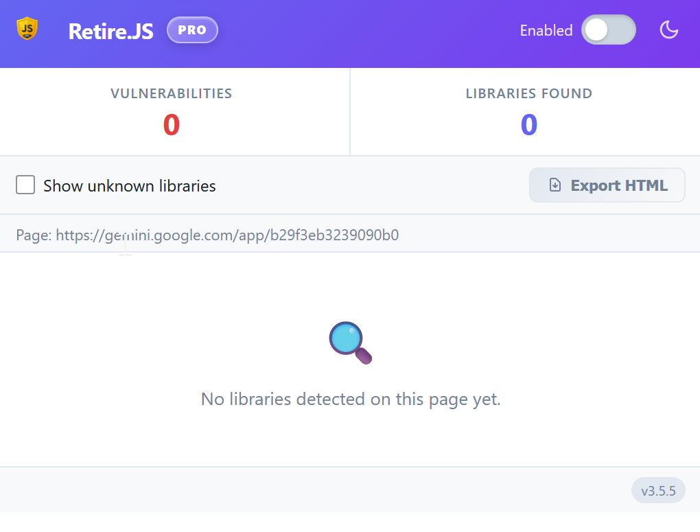
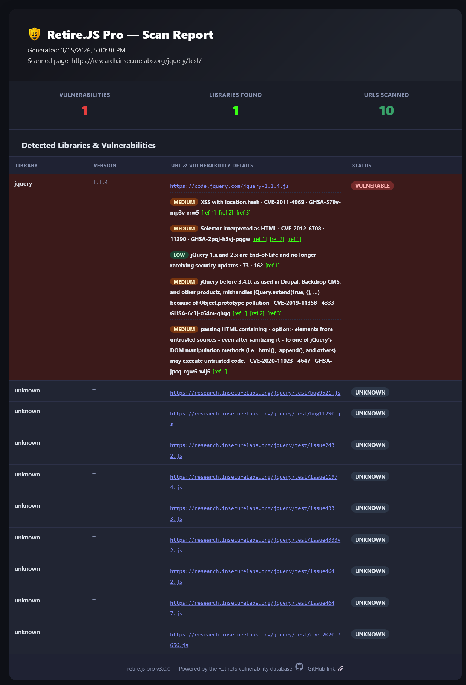

# Screenshots — retire.js pro

This page contains the full screenshot set (kept out of the main README to keep it scannable).

---

## Popup UI

<table>
  <tr>
    <td align="center">
      
       Dark (no results)
    </td>
    <td align="center">
      
       Dark (with results)
    </td>
  </tr>
  <tr>
    <td align="center">
      
       Light (no results)
    </td>
    <td align="center">
      
       Light (with results)
    </td>
  </tr>
</table>

---

## Report Export

  

